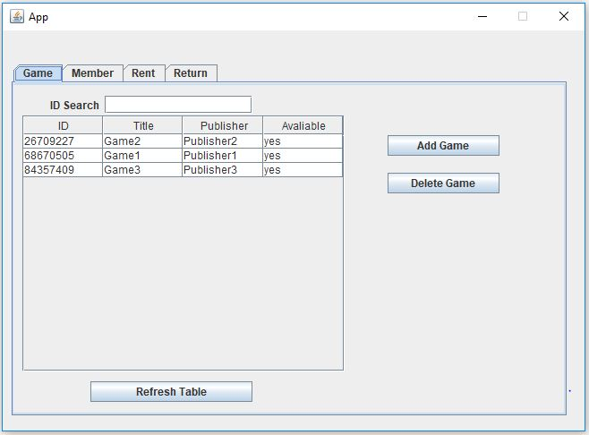
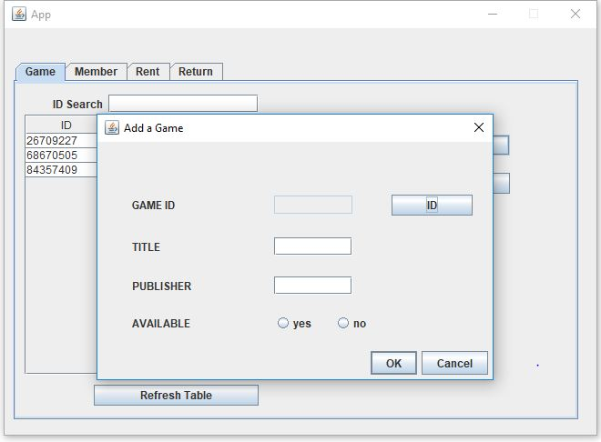
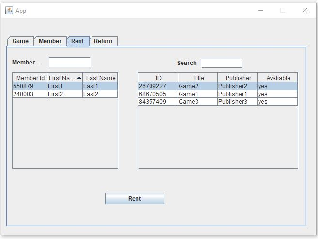
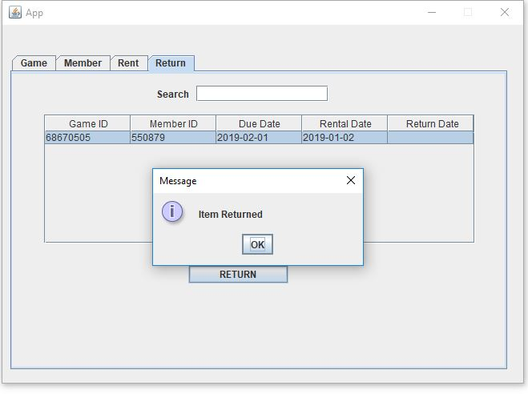

# GameRental


### Prerequisites

- Java Version 8  
  https://www.java.com/en/download/

- PostgresSQL  
  https://www.postgresql.org/download/

- Maven  
  https://maven.apache.org/download.cgi
  
 
 
 ### Installing
 ##### Getting the source code:
 ```bash
git clone https://github.com/shggd/GameRental.git
```

 ##### Config the database:
Login to PostgresSQL, create a database, then import db.sql.
```bash
postgres=# create database mydb;
postgres=# \c mydb
mydb=# \i 'db.sql'
```
  
com.database.Database.java config
```java
    public static Connection connect() {
        //Database LINK
        final String host = "jdbc:postgresql://127.0.0.1:5432/mydb"; //jdbc:postgresql://{database host}:{port number}/{database name}
        final String uname = "";//database username
        final String pass = "";//database password
        Connection mycon = null;
        try {
            mycon = DriverManager.getConnection(host, uname, pass);
            return mycon;
        } catch (SQLException e) {
            e.printStackTrace();
            return null;
        }

    }
```
 ##### Maven:
 ```bash
 mvn --version
 ```
 Make sure we using jdk and not jre
  ```bash
  Apache Maven 3.6.0 (97c98ec64a1fdfee7767ce5ffb20918da4f719f3; 2018-10-24T20:41:47+02:00)
Maven home: D:\apache-maven-3.6.0\bin\..
Java version: 1.8.0_161, vendor: Oracle Corporation, runtime: C:\Program Files\Java\jdk1.8.0_191\jre
Default locale: nl_NL, platform encoding: Cp1252
OS name: "windows 7", version: "6.1", arch: "amd64", family: "windows"
  ```
  
 Maven build  
  ```bash
  cd gamerental
  mvn package
  ```
  Run target/maven-1.0-jar-with-dependencies.jar
    
 ## Screenshots






  
  

